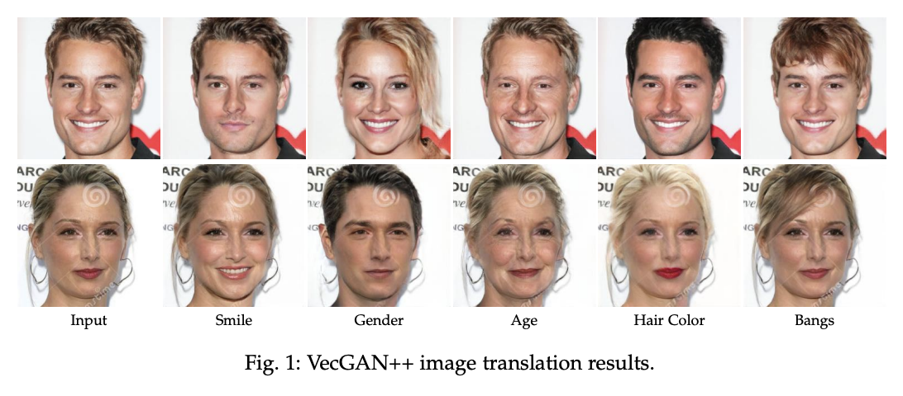
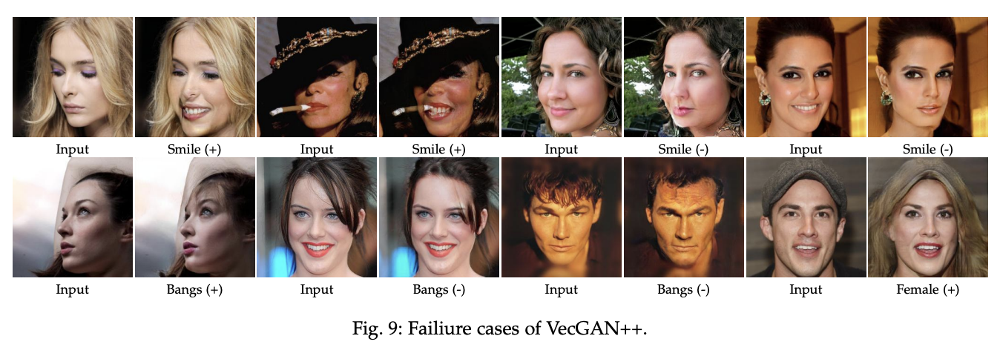

# VecGAN/VecGAN++
Inference code for the work "[Image-to-Image Translation with Disentangled Latent Vectors for Face Editing](https://ieeexplore.ieee.org/document/10229229)" (TPAMI, 2023). This work is an extension to the paper titled "[VecGAN: Image-to-Image Translation with Interpretable Latent Directions](https://www.ecva.net/papers/eccv_2022/papers_ECCV/html/3685_ECCV_2022_paper.php)" (ECCV 2022).

<p float="center">
 
<br>

</p>
<p align="center">
Our image-to-image translation model applies edits to difrerent facial attributes (bangs. hair color. age, gender, smile) using disentangled latent directions. We adopt an end-to-end learning scheme where the translation and reconstruction objective is learned altogether. Our approach also includes an attention-based residual mechanism to ensure that edits preserve the input image. In the provided example, we demonstrate the learned edits on two samples.
</p>

## Prerequisites
We test our inference script under the following prerequisites:
- Linux
    - Tested on Ubuntu 18.04
- Can be run on CPU and GPU
    - You can specify the device in inference options
- We use miniconda to install our dependencies. We strongly recommend using [conda](https://docs.conda.io/en/latest/) for installation.

## Installation
We test our implementation using Python 3.9. To setup the environment, you can use the following command:
```
conda create --name vecgan python=3.9
```
Our implementation is based on PyTorch 1.10 and cudatoolkit 11.3. You can install these packages using the [official instructions](https://pytorch.org/get-started/previous-versions/):
```
# CUDA 11.3
conda install pytorch==1.10.0 torchvision==0.11.0 torchaudio==0.10.0 cudatoolkit=11.3 -c pytorch -c conda-forge
```

In addition to these packages, our code also depends on easydict. You can install it using the following command:
```
pip install easydict
```

## Pretrained Model
The model checkpoint can be downloaded using [this Google Drive link](https://drive.google.com/file/d/1CYVjjXYIopfcdZ5a6ya875UzB2p8NAxW/view?usp=sharing). In the default setting, the checkpoint should be located inside the `checkpoints` folder.

## Running Inference
To run the inference code, you can use the following commands:

```
# Latent-guided
python inference.py --device <cuda or cpu> \
                    --config_path <path to config file> \
                    --checkpoint_path <path to checkpoint file> \
                    --input_path <path to input image> \
                    --output_path <path to output_folder> \
                    --mode l \
                    --tag <5> (check the config file for the index order) \
                    --attribute <0> (check the config file for the index order) \
                    --z <a scalar value within the range [0, 1]>
```

```
# Reference-guided
python inference.py --device <cuda or cpu> \
                    --config_path <path to config file> \
                    --checkpoint_path <path to checkpoint file> \
                    --input_path <path to input image> \
                    --output_path <path to output folder> \
                    --mode r \
                    --tag  <5> (check the config file for the index order) \
                    --reference_path <path to reference image>
```

For more details about the inference options, you can check `config/model_config.py`. 

## Sample Images
To ensure that the model works as intended, we provide sample images in the `samples`` folder for the tags bangs, hair color, age, gender, and smile along with the outputs. You can find the used tag, attribute and z values in the output file name.

## Failure Cases
Even though we achieve successful editing results on the CelebA-HQ dataset, our model fails on certain cases, as we discuss in the paper presenting VecGAN++. Below, you can see a table of common failiure cases faced by our model. For a more detailed discussion of such cases please refer to the [paper](https://ieeexplore.ieee.org/document/10229229).

<p float="center">
 
<br>

## Tasks To Be Done
- [x] Releasing single image inference script
- [ ] Releasing the FID evaluation with folder-wise generation code


## Citation
The entries which you can use for citing are provided below.

VecGAN++:
```
@article{dalva2023image,
  title={Image-to-Image Translation with Disentangled Latent Vectors for Face Editing},
  author={Dalva, Yusuf and Pehlivan, Hamza and Hatipoglu, Oyku Irmak and Moran, Cansu and Dundar, Aysegul},
  journal={IEEE Transactions on Pattern Analysis and Machine Intelligence},
  year={2023},
  publisher={IEEE}
}
```

VecGAN:
```
@inproceedings{dalva2022vecgan,
  title={Vecgan: Image-to-image translation with interpretable latent directions},
  author={Dalva, Yusuf and Alt{\i}ndi{\c{s}}, Said Fahri and Dundar, Aysegul},
  booktitle={European Conference on Computer Vision},
  pages={153--169},
  year={2022},
  organization={Springer}
}
```
# Ackonwledgements
Our codebase is based on [HiSD](https://github.com/imlixinyang/HiSD). We would like to share our appreciation for making their work open source.
